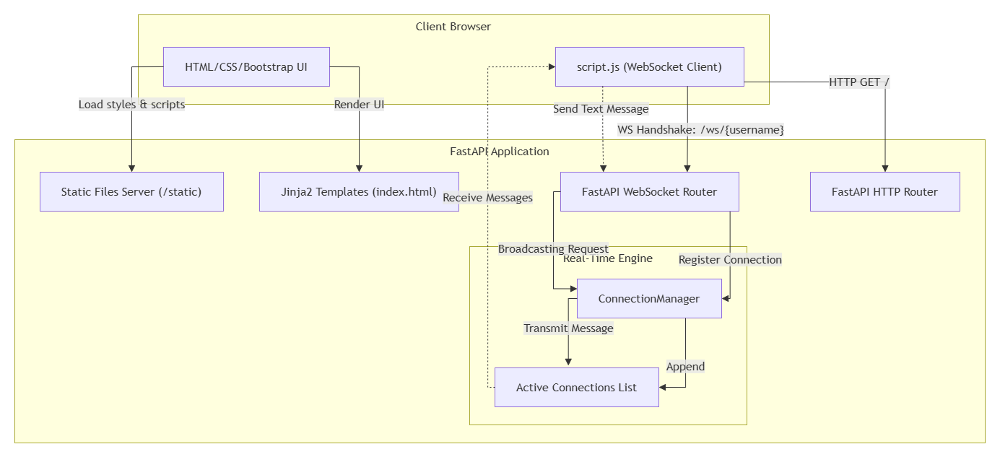

# OrbitChat - Live Messaging Application

OrbitChat is a modern, lightweight, and responsive real-time chat application. It allows multiple users to join a shared room and broadcast messages to each other instantly. The project demonstrates bi-directional socket communication, custom styling, and asynchronous backend event broadcasting.

---

## 🚀 About the Project

OrbitChat features a sleek, user-friendly interface that lets users chat instantly.
* **Instant Join**: Users can enter a display name and immediately join the active chat lobby.
* **Real-time Communication**: Messages are delivered instantly to all connected users using WebSockets.
* **System Event Notifications**: The app automatically broadcasts when a user joins or leaves the chat.
* **Responsive Design**: Clean layout that adapts beautifully to both mobile and desktop screens.

---

## 🛠️ Technology & Stack Used

### Backend
* **Python**: Core programming language.
* **FastAPI**: A modern, fast (high-performance), web framework for building APIs with Python 3.8+ based on standard Python-type hints. Handled WebSocket routing and connection management.
* **Uvicorn**: An ASGI web server implementation for Python, used to run the FastAPI app.
* **Jinja2**: Templating engine used to render the HTML structure.

### Frontend
* **HTML5**: Used to build the main structure of the chat web pages.
* **Bootstrap 5**: CSS framework used to make the layout look clean and fit different screen sizes.
* **Custom CSS**: Used to design the custom chat bubbles, user buttons, colors, and smooth fade-in animations.
* **JavaScript**: Used to establish the WebSocket connection, send typed messages, and show incoming messages in real-time.
* **AI-Assisted UI**: Frontend layout and styling were generated using AI tools.


---

## 📊 Flow Diagram

Below is the conceptual architecture and data flow for the chat application:



---

## 💡 What We Learned

Building this application provided deep insights into designing real-time, asynchronous systems:

1. **WebSocket Protocol vs. HTTP**:
   We learned how WebSockets differ from traditional HTTP requests. Instead of repeated polling, WebSockets open a single persistent connection that allows both client and server to push messages at any time.

2. **Asynchronous Programming in Python**:
   Using FastAPI's `async` and `await` keywords, we learned how to write concurrent code that scales well and processes many simultaneous connections without blocking the main event loop.

3. **Connection Lifecycle Management**:
   We designed and implemented a `ConnectionManager` class that:
   * Registers/accepts connections (`connect`).
   * Cleans up closed sockets on tab close or navigation (`disconnect`).
   * Handles multi-client broadcasting through asynchronous iteration (`broadcast`).

4. **Structured JSON Payloads**:
   We worked with JSON message payloads. The server processes and sends serialized JSON strings (containing `user` and `message` properties), enabling the client script to easily parse and differentiate between regular user chats and system announcements (e.g., join/leave alerts).

---

## ⚙️ Setup and Installation

Follow these steps to run OrbitChat locally on your system:

### 1. Clone the Repository
```bash
git clone <your-repository-url>
cd chat_app
```

### 2. Set Up a Virtual Environment (Optional but Recommended)
For Windows:
```powershell
python -m venv .venv
.venv\Scripts\activate
```

For macOS/Linux:
```bash
python3 -m venv .venv
source .venv/bin/activate
```

### 3. Install Dependencies
```bash
pip install fastapi uvicorn jinja2
```

### 4. Start the Server
Run the FastAPI application with Uvicorn in hot-reload mode:
```bash
uvicorn main:app --reload
```

### 5. Access the App
Open your favorite web browser and navigate to:
```text
http://127.0.0.1:8000
```
Enter your display name and start chatting!
